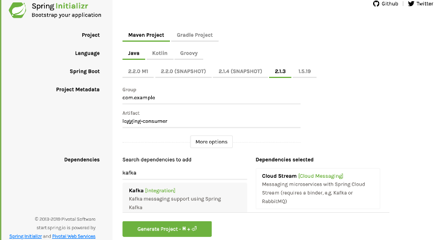

### Quick Start

// TODO: Need to update with .NET specfics

You can try Spring Cloud Stream in less then 5 min even before you jump into any details by following this three-step guide.

We show you how to create a Spring Cloud Stream application that receives messages coming from the messaging middleware of your choice (more on this later) and logs received messages to the console.
We call it `LoggingConsumer`.
While not very practical, it provides a good introduction to some of the main concepts
and abstractions, making it easier to digest the rest of this user guide.

The three steps are as follows:

1. [Creating a Sample Application by Using Spring Initializr](#spring-cloud-stream-preface-creating-sample-application)
1. [Importing the Project into Your IDE](#spring-cloud-stream-preface-importing-project)
1. [Adding a Message Handler, Building, and Running](#spring-cloud-stream-preface-adding-message-handler)

#### <a name="spring-cloud-stream-preface-creating-sample-application"></a>Creating a Sample Application by Using Spring Initializr
To get started, visit the [Spring Initializr](https://start.spring.io). From there, you can generate our `LoggingConsumer` application. To do so:

1. In the *Dependencies* section, start typing `stream`.
    When the "`Cloud Stream`" option should appears, select it.
1. Start typing either 'kafka' or 'rabbit'.
1. Select "`Kafka`" or "`RabbitMQ`".
    Basically, you choose the messaging middleware to which your application binds.
    We recommend using the one you have already installed or feel more comfortable with installing and running.
    Also, as you can see from the Initilaizer screen, there are a few other options you can choose.
    For example, you can choose Gradle as your build tool instead of Maven (the default).
1. In the *Artifact* field, type 'logging-consumer'.
    The value of the *Artifact* field becomes the application name.
    If you chose RabbitMQ for the middleware, your Spring Initializr should now be as follows:

    

1. Click the *Generate Project* button.
    Doing so downloads the zipped version of the generated project to your hard drive.
1. Unzip the file into the folder you want to use as your project directory.

TIP: We encourage you to explore the many possibilities available in the Spring Initializr.
It lets you create many different kinds of Spring applications.

#### <a name="spring-cloud-stream-preface-importing-project"></a>Importing the Project into Your IDE

Now you can import the project into your IDE.
Keep in mind that, depending on the IDE, you may need to follow a specific import procedure.
For example, depending on how the project was generated (Maven or Gradle), you may need to follow specific import procedure (for example, in Eclipse or STS, you need to use File -> Import -> Maven -> Existing Maven Project).

Once imported, the project must have no errors of any kind. Also, `src/main/java` should contain `com.example.loggingconsumer.LoggingConsumerApplication`.

Technically, at this point, you can run the application's main class.
It is already a valid Spring Boot application.
However, it does not do anything, so we want to add some code.

#### <a name="spring-cloud-stream-preface-adding-message-handler"></a>Adding a Message Handler, Building, and Running

Modify the `com.example.loggingconsumer.LoggingConsumerApplication` class to look as follows:

```java
@SpringBootApplication
@EnableBinding(Sink.class)
public class LoggingConsumerApplication {

	public static void main(String[] args) {
		SpringApplication.run(LoggingConsumerApplication.class, args);
	}

	@StreamListener(Sink.INPUT)
	public void handle(Person person) {
		System.out.println("Received: " + person);
	}

	public static class Person {
		private String name;
		public String getName() {
			return name;
		}
		public void setName(String name) {
			this.name = name;
		}
		public String toString() {
			return this.name;
		}
	}
}
```

As you can see from the preceding listing:

* We have enabled `Sink` binding (input-no-output) by using `@EnableBinding(Sink.class)`.
Doing so signals to the framework to initiate binding to the messaging middleware, where it automatically creates the destination (that is, queue, topic, and others) that are bound to the `Sink.INPUT` channel.
* We have added a `handler` method to receive incoming messages of type `Person`.
Doing so lets you see one of the core features of the framework: It tries to automatically convert incoming message payloads to type `Person`.

You now have a fully functional Spring Cloud Stream application that does listens for messages.
From here, for simplicity, we assume you selected RabbitMQ in [step one](#spring-cloud-stream-preface-creating-sample-application).
Assuming you have RabbitMQ installed and running, you can start the application by running its `main` method in your IDE.

You should see following output:

```
	--- [ main] c.s.b.r.p.RabbitExchangeQueueProvisioner : declaring queue for inbound: input.anonymous.CbMIwdkJSBO1ZoPDOtHtCg, bound to: input
	--- [ main] o.s.a.r.c.CachingConnectionFactory       : Attempting to connect to: [localhost:5672]
	--- [ main] o.s.a.r.c.CachingConnectionFactory       : Created new connection: rabbitConnectionFactory#2a3a299:0/SimpleConnection@66c83fc8. . .
	. . .
	--- [ main] o.s.i.a.i.AmqpInboundChannelAdapter      : started inbound.input.anonymous.CbMIwdkJSBO1ZoPDOtHtCg
	. . .
	--- [ main] c.e.l.LoggingConsumerApplication         : Started LoggingConsumerApplication in 2.531 seconds (JVM running for 2.897)
```

Go to the RabbitMQ management console or any other RabbitMQ client and send a message to `input.anonymous.CbMIwdkJSBO1ZoPDOtHtCg`.
The `anonymous.CbMIwdkJSBO1ZoPDOtHtCg` part represents the group name and is generated, so it is bound to be different in your environment.
For something more predictable, you can use an explicit group name by setting `spring.cloud.stream.bindings.input.group=hello` (or whatever name you like).

The contents of the message should be a JSON representation of the `Person` class, as follows:

	{"name":"Sam Spade"}

Then, in your console, you should see:

`Received: Sam Spade`

You can also build and package your application into a boot jar (by using `./mvnw clean install`) and run the built JAR by using the `java -jar` command.

Now you have a working (albeit very basic) Spring Cloud Stream application.

[partintro]
--
This section goes into more detail about how you can work with Spring Cloud Stream.
It covers topics such as creating and running stream applications.
--